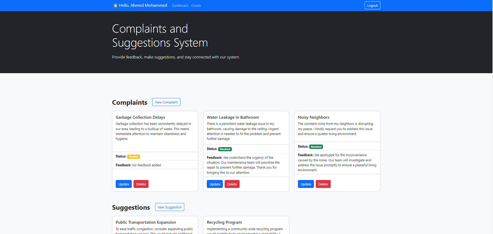
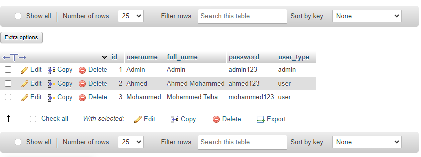

# Complaints and Suggestions Web Application

## Overview
The Complaints and Suggestions Web App is a robust CRUD (Create, Read, Update, Delete) application developed with PHP for the backend, MySQLi for database connectivity, and Bootstrap 5.3.2 for the frontend. The primary focus is on the backend, and Bootstrap is utilized for its CSS framework to streamline frontend development.

- [Complaints and Suggestions Web Application](#complaints-and-suggestions-web-application)
  - [Overview](#overview)
  - [Key Technologies](#key-technologies)
    - [Directory Structure](#directory-structure)
    - [User Management](#user-management)
    - [Authentication](#authentication)
    - [Error Logging](#error-logging)
    - [Security](#security)
  - [User Capabilities](#user-capabilities)
  - [Admin Capabilities](#admin-capabilities)
  - [Installation](#installation)
  - [Login Credentials](#login-credentials)

## Key Technologies

- **Frontend:** HTML, Bootstrap 5.3.2
- **Backend:** PHP, MySQLi Connection, MySQL Database

### Directory Structure

The codebase follows a structured and clear directory layout for easy understanding.

### User Management

- Users are manually created through phpMyAdmin or SQL terminal commands.
- Future versions will include a user registration form for a more user-friendly experience.

### Authentication

- A robust login system caters to two user types: admin and regular users.

### Error Logging

- Errors are logged in the `logs/error.log` file for streamlined debugging.

### Security

- Passwords are stored in the database without proper hashing, posing a security risk.
- Future releases will implement secure password storage practices.

## User Capabilities

- **Feedback Submission:** Users can effortlessly submit complaints or suggestions.
- **Feedback Management:** An intuitive interface empowers users to view, update, and delete their submitted feedback.



## Admin Capabilities

- **Feedback Review:** Admins can provide feedback on all complaints or suggestions submitted by users.
- **Comprehensive Dashboard:** Admins have access to an overview of all feedback, ensuring efficient management.
- **Feedback Administration:** Admins have complete control to update feedback content or remove entries.


## Installation

1. **Clone the Repository:**
   ```bash
   git clone https://github.com/khaledsAlshibani/php-mysql-complaints-app.git
   ```

2. **Import the Database:**
  - Navigate to the `assets > database` folder and find the `complaints_suggestions_db.sql` file.
  - Create a MySQL database using your preferred method, such as [phpMyAdmin](http://localhost/phpmyadmin/index.php) for localhost installations.
  - Import the database file into the created database.

## Login Credentials



**Admin:**
- **Username:** `Admin`
- **Password:** `admin123`

**Users:**
1. **Username:** `Ahmed`
   - **Password:** `ahmed123`

2. **Username:** `Mohammed`
   - **Password:** `mohammed2123`